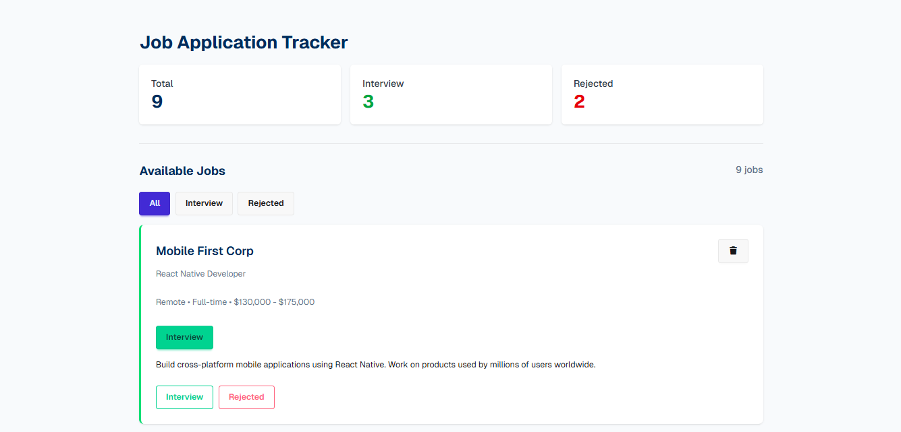

  
  # Job Application tracker
  
  
  

 

This was the fourth assignment assigned to me as the part of the course where I was provided with a Figma file and some instructions. My goal was to create a functional website with identical UI as Figma using raw HTML and CSS and vanilla javascript

I was successfully able to recreate the UI and make it functional as instructed which achieved me max marks for the assignment

Projects Sneakpeak:  

## Technical details

Tech Stack:

## Features

- <b> Core </b>: When the webapge loads, it will show all the job without any tag as well job counts on the two distinct places
- <b> Delete Button </b>: Delete button will delete the job from the listing. 
- <b> Interview Button </b>: If interview button clicked, that specific job needs to have a interview badge, a green border, count needs to be updated and interview tab must show the job
- <b> Rejected Button </b>: If reject button clicked, that specific job needs to have a rejected badge, a red border, count needs to be updated and reject tab must show the job
 
 

If you have any query related to this project, let me know.